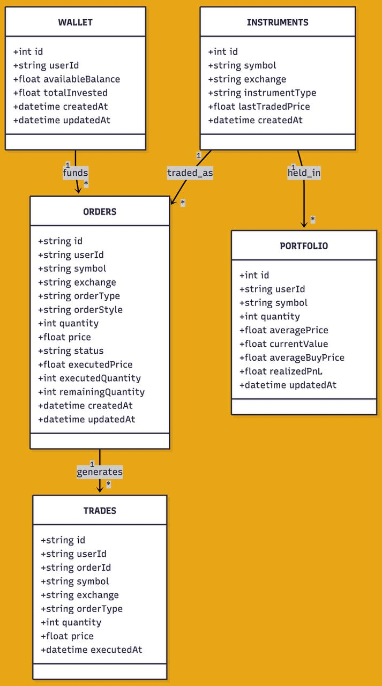
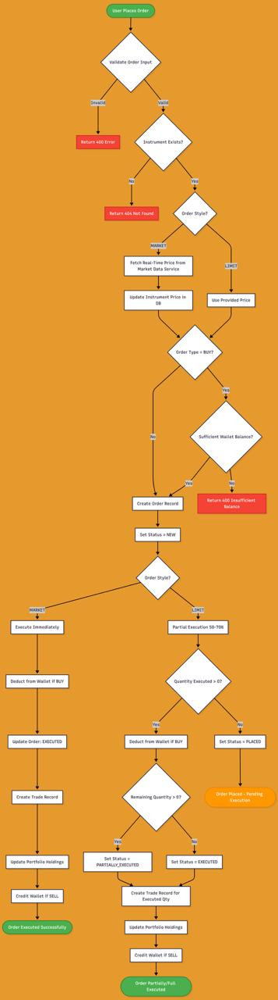

#NexTrade Engine

I have built a simplified trading platform using SDK and REST API simulation. The project demonstrates backend system design, clean RESTful API development, and core trading workflows such as instrument discovery, order placement, order status tracking, trade execution, and portfolio management using in-memory data storage.

##  Table of Contents

- [Features](#features)
- [Tech Stack](#tech-stack)
- [Project Structure](#project-structure)
- [Setup and Installation](#setup-and-installation)
- [Running the Application](#running-the-application)
- [API Documentation](#api-documentation)
- [Sample API Usage](#sample-api-usage)
- [Frontend Interface](#frontend-interface)
- [Database Schema](#database-schema)
- [Assumptions and Implementation Notes](#assumptions-and-implementation-notes)
- [Testing](#testing)
- [Contributing](#contributing)
- [License](#license)

##  PFD

<div align="center">
  
  <p><em> Trading Platform Dashboard</em></p>
</div>

<div align="center">
  
  <p><em> Trading Platform Interface</em></p>
</div>

##  Features

### Backend Features
- **Instrument Management**: Discover and query available trading instruments with real-time market data
- **Order Management**: Place market and limit orders with automatic execution simulation
- **Trade Execution**: Track executed trades with detailed execution information
- **Portfolio Management**: View holdings with real-time P&L calculations
- **Wallet Service**: Manage account balance with buy/sell transactions
- **Order Book**: View active buy/sell orders for any instrument
- **RESTful API**: Clean, well-documented API endpoints following REST principles
- **Swagger Documentation**: Interactive API documentation available at `/api-docs`
- **Database Integration**: SQLite database for persistent data storage
- **Authentication Middleware**: Token-based authentication system (mock mode for development)

### Frontend Features
- **Dashboard**: Real-time overview of trading statistics and portfolio value
- **Instruments Page**: Browse available instruments with live price updates
- **Orders Management**: View and manage all placed orders
- **Trades History**: Complete trade execution history with filtering
- **Portfolio View**: Detailed portfolio holdings with P&L breakdown
- **Responsive Design**: Modern UI built with Material-UI (MUI)
- **Real-time Updates**: Auto-refresh functionality for live data

##  Tech Stack

### Backend
- **Node.js** with **TypeScript**
- **Express.js** - Web framework
- **SQLite3** - Database
- **Winston** - Logging
- **Swagger/OpenAPI** - API documentation
- **Jest** - Testing framework
- **Express Validator** - Request validation

### Frontend
- **React 18** with **TypeScript**
- **Vite** - Build tool and dev server
- **Material-UI (MUI)** - Component library
- **Axios** - HTTP client
- **React Router** - Navigation
- **Recharts** - Data visualization (ready for future use)

##  Project Structure

```
trading-interface-demo-main/
├── backend/
│   ├── src/
│   │   ├── config/
│   │   │   └── swagger.ts          # Swagger/OpenAPI configuration
│   │   ├── database/
│   │   │   └── init.ts             # Database initialization and schema
│   │   ├── middleware/
│   │   │   ├── auth.ts             # Authentication middleware
│   │   │   └── errorHandler.ts     # Error handling middleware
│   │   ├── routes/
│   │   │   ├── auth.ts             # Authentication routes
│   │   │   ├── instruments.ts      # Instrument endpoints
│   │   │   ├── orders.ts           # Order management endpoints
│   │   │   ├── trades.ts           # Trade history endpoints
│   │   │   ├── portfolio.ts        # Portfolio endpoints
│   │   │   ├── wallet.ts           # Wallet/balance endpoints
│   │   │   └── orderbook.ts        # Order book endpoints
│   │   ├── services/
│   │   │   ├── bajajApiClient.ts   # Bajaj API wrapper (mock)
│   │   │   ├── marketDataService.ts # Market data service
│   │   │   ├── priceSimulator.ts   # Price simulation
│   │   │   └── walletService.ts    # Wallet operations
│   │   ├── utils/
│   │   │   ├── logger.ts           # Winston logger setup
│   │   │   └── marketHours.ts      # Market hours utilities
│   │   ├── tests/
│   │   │   └── orders.test.ts      # Test suite
│   │   └── server.ts               # Express server setup
│   ├── package.json
│   ├── tsconfig.json
│   └── jest.config.js
├── frontend/
│   ├── src/
│   │   ├── components/
│   │   │   └── Layout.tsx          # Main layout component
│   │   ├── pages/
│   │   │   ├── Dashboard.tsx       # Dashboard page
│   │   │   ├── Instruments.tsx     # Instruments listing
│   │   │   ├── Orders.tsx          # Orders management
│   │   │   ├── Trades.tsx          # Trades history
│   │   │   └── Portfolio.tsx       # Portfolio view
│   │   ├── services/
│   │   │   └── api.ts              # API client service
│   │   ├── App.tsx                 # Main app component
│   │   ├── main.tsx                # React entry point
│   │   └── index.css               # Global styles
│   ├── package.json
│   ├── vite.config.ts
│   └── tsconfig.json
├── package.json                    # Root package.json with convenience scripts
├── start.sh                        # Startup script (Linux/Mac)
└── README.md

```

##  Setup and Installation

### Prerequisites

- **Node.js** (v16 or higher)
- **npm** (v7 or higher) or **yarn**
- **Git** (for cloning the repository)

### Installation Steps

1. **Clone the repository**
   ```bash
   git clone <repository-url>
   cd trading-interface-demo-main
   ```

2. **Install dependencies for both backend and frontend**
   
   Option 1: Install all at once (recommended)
   ```bash
   npm run install:all
   ```
   
   Option 2: Install separately
   ```bash
   # Backend dependencies
   cd backend
   npm install
   cd ..
   
   # Frontend dependencies
   cd frontend
   npm install
   cd ..
   ```

3. **Configure environment variables**
   
   Create a `.env` file in the `backend/` directory:
   ```bash
   cd backend
   cp .env.example .env  # If .env.example exists
   # Or create manually:
   ```
   
   Minimum required environment variables:
   ```env
   PORT=3001
   NODE_ENV=development
   DB_PATH=./data/trading.db
   JWT_SECRET=bajaj_broking_secret_key_change_in_production
   BAJAJ_API_BASE_URL=https://apitrading.bajajbroking.in/api
   BAJAJ_BRIDGELINK_URL=https://bridgelink.bajajbroking.in/api
   CLIENT_ID=your_client_id_here
   CLIENT_SECRET=your_client_secret_here
   REDIRECT_URL=http://localhost:3000/callback
   ```

4. **Initialize the database**
   
   The database will be automatically initialized when you start the backend server. It will create:
   - All necessary tables
   - Sample instruments (20 popular stocks)
   - Default wallet for mock user with ₹10,00,000 balance

##  Running the Application

### Option 1: Using npm scripts (Recommended)

**Start both servers:**
```bash
# Terminal 1 - Backend
npm run dev:backend

# Terminal 2 - Frontend
npm run dev:frontend
```

### Option 2: Using the startup script

**Linux/Mac:**
```bash
chmod +x start.sh
./start.sh
```

**Windows:**
```powershell
# Start backend
cd backend
npm run dev

# Start frontend (new terminal)
cd frontend
npm run dev
```

### Option 3: Manual start

**Backend Server:**
```bash
cd backend
npm run dev
```
The backend will start on `http://localhost:3001`

**Frontend Server:**
```bash
cd frontend
npm run dev
```
The frontend will start on `http://localhost:3000`

### Access Points

- **Frontend Application**: http://localhost:3000
- **Backend API**: http://localhost:3001
- **API Health Check**: http://localhost:3001/health
- **Swagger API Documentation**: http://localhost:3001/api-docs

##  API Documentation

All API endpoints are documented with Swagger/OpenAPI. Visit http://localhost:3001/api-docs for interactive documentation.

### Base URL
```
http://localhost:3001/api/v1
```

### Authentication

All endpoints (except `/health` and `/api-docs`) require authentication via Bearer token in the Authorization header:

```http
Authorization: Bearer <token>
```

**Note**: In development mode, the system accepts `mock_token` or any non-empty token string. In production, proper JWT validation would be required.

### API Endpoints

#### 1. Health Check

**GET** `/health`

Check if the API server is running.

**Response:**
```json
{
  "status": "ok",
  "message": "Bajaj Broking API is running"
}
```

#### 2. Instruments

**GET** `/api/v1/instruments`

Get all available trading instruments with real-time market data.

**Headers:**
```http
Authorization: Bearer mock_token
```

**Response:**
```json
{
  "status": "success",
  "data": [
    {
      "symbol": "RELIANCE",
      "exchange": "BSE",
      "instrumentType": "EQUITY",
      "lastTradedPrice": 2450.50,
      "change": 25.50,
      "changePercent": 1.05,
      "volume": 1250000,
      "high": 2460.00,
      "low": 2430.00,
      "open": 2445.00
    }
  ],
  "source": "market_data_service"
}
```

#### 3. Orders

**POST** `/api/v1/orders`

Place a new order.

**Headers:**
```http
Authorization: Bearer mock_token
Content-Type: application/json
```

**Request Body:**
```json
{
  "symbol": "RELIANCE",
  "exchange": "BSE",
  "orderType": "BUY",
  "orderStyle": "MARKET",
  "quantity": 10,
  "price": 2450.50
}
```

**Note:** `price` is optional for MARKET orders but required for LIMIT orders.

**Response:**
```json
{
  "status": "success",
  "message": "Order placed successfully",
  "data": {
    "id": "uuid-here",
    "userId": "MOCK_USER_001",
    "symbol": "RELIANCE",
    "exchange": "BSE",
    "orderType": "BUY",
    "orderStyle": "MARKET",
    "quantity": 10,
    "price": 2450.50,
    "status": "EXECUTED",
    "executedPrice": 2450.50,
    "executedQuantity": 10,
    "remainingQuantity": 0,
    "createdAt": "2026-01-08T18:30:00.000Z",
    "updatedAt": "2026-01-08T18:30:00.000Z"
  }
}
```

**GET** `/api/v1/orders`

Get all orders for the authenticated user.

**Response:**
```json
{
  "status": "success",
  "data": [
    {
      "id": "uuid-here",
      "userId": "MOCK_USER_001",
      "symbol": "RELIANCE",
      "exchange": "BSE",
      "orderType": "BUY",
      "orderStyle": "MARKET",
      "quantity": 10,
      "price": 2450.50,
      "status": "EXECUTED",
      "executedPrice": 2450.50,
      "executedQuantity": 10,
      "remainingQuantity": 0,
      "createdAt": "2026-01-08T18:30:00.000Z",
      "updatedAt": "2026-01-08T18:30:00.000Z"
    }
  ]
}
```

**GET** `/api/v1/orders/:orderId`

Get a specific order by ID.

**DELETE** `/api/v1/orders/:orderId`

Cancel an order (only for orders with status NEW, PLACED, or PARTIALLY_EXECUTED).

#### 4. Trades

**GET** `/api/v1/trades`

Get all executed trades for the authenticated user.

**Query Parameters (optional):**
- `symbol` - Filter by symbol
- `side` - Filter by side (BUY/SELL)
- `fromDate` - Filter from date (ISO format)
- `toDate` - Filter to date (ISO format)

**Example:**
```
GET /api/v1/trades?symbol=RELIANCE&side=BUY&fromDate=2026-01-01
```

**Response:**
```json
{
  "status": "success",
  "data": [
    {
      "id": "uuid-here",
      "orderId": "order-uuid",
      "symbol": "RELIANCE",
      "exchange": "BSE",
      "orderType": "BUY",
      "quantity": 10,
      "price": 2450.50,
      "executedAt": "2026-01-08T18:30:00.000Z"
    }
  ],
  "filters": {
    "symbol": "RELIANCE",
    "side": "BUY",
    "fromDate": "2026-01-01",
    "toDate": null
  }
}
```

#### 5. Portfolio

**GET** `/api/v1/portfolio`

Get portfolio holdings with real-time P&L calculations.

**Response:**
```json
{
  "status": "success",
  "data": [
    {
      "symbol": "RELIANCE",
      "quantity": 10,
      "averagePrice": 2450.50,
      "currentMarketPrice": 2475.00,
      "currentValue": 24750.00,
      "realizedPnL": 0,
      "unrealizedPnL": 245.00,
      "unrealizedPnLPercent": 1.00,
      "totalPnL": 245.00
    }
  ]
}
```

#### 6. Wallet

**GET** `/api/v1/wallet`

Get wallet balance information.

**Response:**
```json
{
  "status": "success",
  "data": {
    "availableBalance": 975500.00,
    "totalInvested": 24500.00
  }
}
```

#### 7. Order Book

**GET** `/api/v1/orderbook/:symbol`

Get order book (buy and sell orders) for a specific symbol.

**Example:**
```
GET /api/v1/orderbook/RELIANCE
```

**Response:**
```json
{
  "status": "success",
  "data": {
    "symbol": "RELIANCE",
    "buyOrders": [
      {
        "orderId": "uuid-here",
        "price": 2445.00,
        "quantity": 5,
        "executedQuantity": 0,
        "status": "PLACED"
      }
    ],
    "sellOrders": [
      {
        "orderId": "uuid-here",
        "price": 2455.00,
        "quantity": 10,
        "executedQuantity": 0,
        "status": "PLACED"
      }
    ]
  }
}
```

#### 8. Authentication

**GET** `/api/v1/auth/authorize`

Get authorization URL for OAuth flow.

**Response:**
```json
{
  "status": "success",
  "data": {
    "authorizationUrl": "https://bridgelink.bajajbroking.in/api/..."
  }
}
```

**POST** `/api/v1/auth/token`

Exchange authorization code for access token.

**Request Body:**
```json
{
  "code": "authorization_code_here"
}
```

**GET** `/api/v1/auth/profile`

Get user profile information (requires authentication).

##  Sample API Usage

### Using cURL

#### 1. Health Check
```bash
curl http://localhost:3001/health
```

#### 2. Get All Instruments
```bash
curl -X GET http://localhost:3001/api/v1/instruments \
  -H "Authorization: Bearer mock_token"
```

#### 3. Place a Market Order
```bash
curl -X POST http://localhost:3001/api/v1/orders \
  -H "Authorization: Bearer mock_token" \
  -H "Content-Type: application/json" \
  -d '{
    "symbol": "RELIANCE",
    "exchange": "BSE",
    "orderType": "BUY",
    "orderStyle": "MARKET",
    "quantity": 10
  }'
```

#### 4. Place a Limit Order
```bash
curl -X POST http://localhost:3001/api/v1/orders \
  -H "Authorization: Bearer mock_token" \
  -H "Content-Type: application/json" \
  -d '{
    "symbol": "TCS",
    "exchange": "BSE",
    "orderType": "BUY",
    "orderStyle": "LIMIT",
    "quantity": 5,
    "price": 3400.00
  }'
```

#### 5. Get All Orders
```bash
curl -X GET http://localhost:3001/api/v1/orders \
  -H "Authorization: Bearer mock_token"
```

#### 6. Get Trades
```bash
curl -X GET "http://localhost:3001/api/v1/trades?symbol=RELIANCE&side=BUY" \
  -H "Authorization: Bearer mock_token"
```

#### 7. Get Portfolio
```bash
curl -X GET http://localhost:3001/api/v1/portfolio \
  -H "Authorization: Bearer mock_token"
```

#### 8. Get Wallet Balance
```bash
curl -X GET http://localhost:3001/api/v1/wallet \
  -H "Authorization: Bearer mock_token"
```

#### 9. Get Order Book
```bash
curl -X GET http://localhost:3001/api/v1/orderbook/RELIANCE \
  -H "Authorization: Bearer mock_token"
```

#### 10. Cancel an Order
```bash
curl -X DELETE http://localhost:3001/api/v1/orders/{orderId} \
  -H "Authorization: Bearer mock_token"
```

### Using JavaScript/TypeScript

```typescript
import axios from 'axios';

const api = axios.create({
  baseURL: 'http://localhost:3001/api/v1',
  headers: {
    'Authorization': 'Bearer mock_token',
    'Content-Type': 'application/json'
  }
});

// Get instruments
const instruments = await api.get('/instruments');

// Place order
const order = await api.post('/orders', {
  symbol: 'RELIANCE',
  exchange: 'BSE',
  orderType: 'BUY',
  orderStyle: 'MARKET',
  quantity: 10
});

// Get portfolio
const portfolio = await api.get('/portfolio');
```

### Using Postman

1. Import the Swagger spec from `http://localhost:3001/api-docs`
2. Set environment variable: `baseUrl = http://localhost:3001/api/v1`
3. Set Authorization header: `Bearer mock_token` in Collection settings
4. Test all endpoints directly from Postman

##  Frontend Interface

The frontend provides a modern, responsive web interface with the following pages:

### Dashboard
- Real-time statistics overview
- Available balance, instrument count, orders, trades, and portfolio value
- Auto-refreshes every 10 seconds

### Instruments
- List of all available trading instruments
- Real-time price updates with change indicators
- Volume and price statistics
- Manual refresh capability

### Orders
- View all placed orders
- Order status tracking
- Order details (symbol, type, quantity, price, execution details)
- Cancel orders functionality

### Trades
- Complete trade execution history
- Filter by symbol, side, and date range
- Detailed trade information

### Portfolio
- Holdings overview with current values
- Realized and unrealized P&L calculations
- P&L percentage indicators
- Quantity and average buy price

##  Database Schema

The application uses SQLite with the following tables:

### `instruments`
- `id` (INTEGER PRIMARY KEY)
- `symbol` (TEXT UNIQUE)
- `exchange` (TEXT)
- `instrumentType` (TEXT)
- `lastTradedPrice` (REAL)
- `createdAt` (DATETIME)

### `orders`
- `id` (TEXT PRIMARY KEY, UUID)
- `userId` (TEXT)
- `symbol` (TEXT)
- `exchange` (TEXT)
- `orderType` (TEXT: BUY/SELL)
- `orderStyle` (TEXT: MARKET/LIMIT)
- `quantity` (INTEGER)
- `price` (REAL, nullable)
- `status` (TEXT: NEW/PLACED/PARTIALLY_EXECUTED/EXECUTED/CANCELLED)
- `executedPrice` (REAL, nullable)
- `executedQuantity` (INTEGER)
- `remainingQuantity` (INTEGER)
- `createdAt` (DATETIME)
- `updatedAt` (DATETIME)

### `trades`
- `id` (TEXT PRIMARY KEY, UUID)
- `userId` (TEXT)
- `orderId` (TEXT, FOREIGN KEY)
- `symbol` (TEXT)
- `exchange` (TEXT)
- `orderType` (TEXT)
- `quantity` (INTEGER)
- `price` (REAL)
- `executedAt` (DATETIME)

### `portfolio`
- `id` (INTEGER PRIMARY KEY)
- `userId` (TEXT)
- `symbol` (TEXT)
- `quantity` (INTEGER)
- `averagePrice` (REAL)
- `currentValue` (REAL)
- `averageBuyPrice` (REAL)
- `realizedPnL` (REAL)
- `updatedAt` (DATETIME)
- UNIQUE(userId, symbol)

### `wallet`
- `id` (INTEGER PRIMARY KEY)
- `userId` (TEXT UNIQUE)
- `availableBalance` (REAL, default: 1000000)
- `totalInvested` (REAL, default: 0)
- `createdAt` (DATETIME)
- `updatedAt` (DATETIME)

##  Assumptions and Implementation Notes

### Assumptions

1. **Authentication**: 
   - In development mode, a mock authentication system is used that accepts any non-empty Bearer token
   - All requests use a mock user ID: `MOCK_USER_001`
   - In production, proper JWT validation and OAuth flow would be implemented

2. **Order Execution**:
   - **MARKET orders**: Execute immediately at the current market price
   - **LIMIT orders**: Execute partially (50-70% of quantity) at the limit price to simulate real-world behavior
   - Order execution is simulated locally without actual external broker integration

3. **Market Data**:
   - Initial prices are seeded from the database
   - Real-time price updates are attempted via market data service but fall back to cached prices
   - Price simulation service can generate realistic price movements

4. **Balance Management**:
   - Default wallet balance: ₹10,00,000 (1 million)
   - Balance is deducted on BUY orders and credited on SELL orders
   - Balance checks are performed before order placement

5. **Portfolio Calculation**:
   - Average buy price is calculated using weighted average
   - Unrealized P&L is calculated based on current market price vs average buy price
   - Realized P&L is tracked on sell orders (not fully implemented in current version)

6. **Database**:
   - SQLite is used for simplicity and portability
   - Database file is created automatically in `backend/data/trading.db`
   - All tables are created on first run

7. **Bajaj API Integration**:
   - The Bajaj API client is implemented as a wrapper but uses mock responses
   - Actual API integration would require valid credentials and proper OAuth flow
   - The system gracefully falls back to local simulation when external APIs are unavailable

8. **Error Handling**:
   - All errors are logged using Winston logger
   - Consistent error response format across all endpoints
   - Validation errors return detailed information

9. **CORS**:
   - CORS is enabled for all origins in development
   - In production, specific origins should be configured

10. **Market Hours**:
    - Market hours checking utility is available but not strictly enforced
    - Orders can be placed at any time in the current implementation

### Implementation Notes

1. **Order Status Flow**:
   - NEW → PLACED → PARTIALLY_EXECUTED/EXECUTED
   - MARKET orders go directly to EXECUTED
   - LIMIT orders may remain PLACED or become PARTIALLY_EXECUTED/EXECUTED

2. **Price Priority**:
   - For MARKET orders: Uses real-time price from market data service or cached price
   - For LIMIT orders: Uses the specified limit price

3. **Portfolio Updates**:
   - Portfolio is automatically updated on order execution
   - BUY orders add to holdings, SELL orders reduce holdings
   - If quantity reaches 0, the portfolio entry is maintained but quantity is 0

4. **Wallet Updates**:
   - BUY orders deduct balance immediately on execution
   - SELL orders credit balance on execution
   - `totalInvested` tracks total money used for buying

##  Testing

### Running Tests

```bash
cd backend
npm test
```

### Test Coverage

The backend includes unit tests for order placement and execution logic. Run tests with coverage:

```bash
npm test -- --coverage
```

## Future Enhancements

- [ ] Real-time WebSocket integration for live price updates
- [ ] Comprehensive test suite with higher coverage
- [ ] Rate limiting and request throttling
- [ ] Advanced order types (Stop Loss, Trailing Stop)
- [ ] Historical data and charts
- [ ] Multiple user support with proper authentication
- [ ] Order matching engine simulation
- [ ] Real Bajaj Broking API integration
- [ ] Docker containerization
- [ ] CI/CD pipeline setup

##  License

This project is licensed under the MIT License.

##  Author

**Rahul Singla**
- GitHub: [Rahul-0012](https://github.com/Rahul-0012)

##  Acknowledgments

- Bajaj Broking for providing the API specification
- Material-UI for the excellent React component library
- The open-source community for the amazing tools and libraries

---

**Note**: This is a demonstration project built for a campus hiring assignment. For production use, additional security measures, error handling, and testing would be required.

